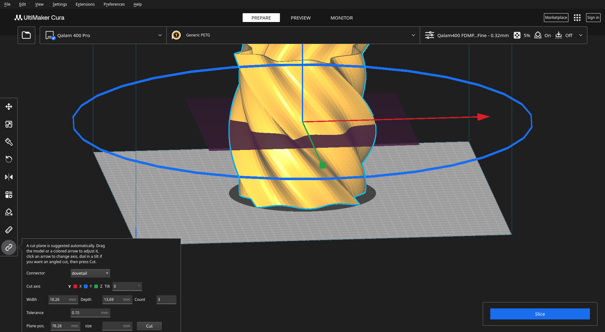
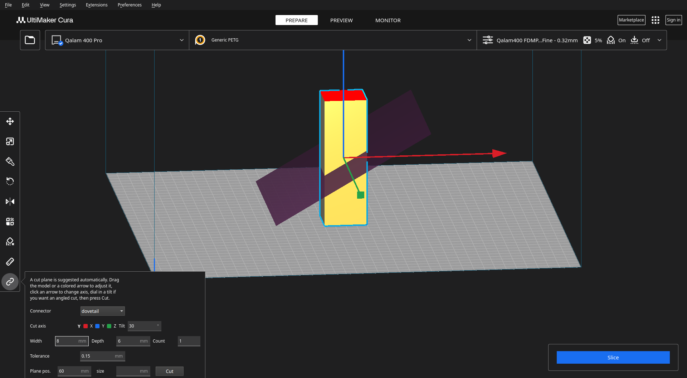
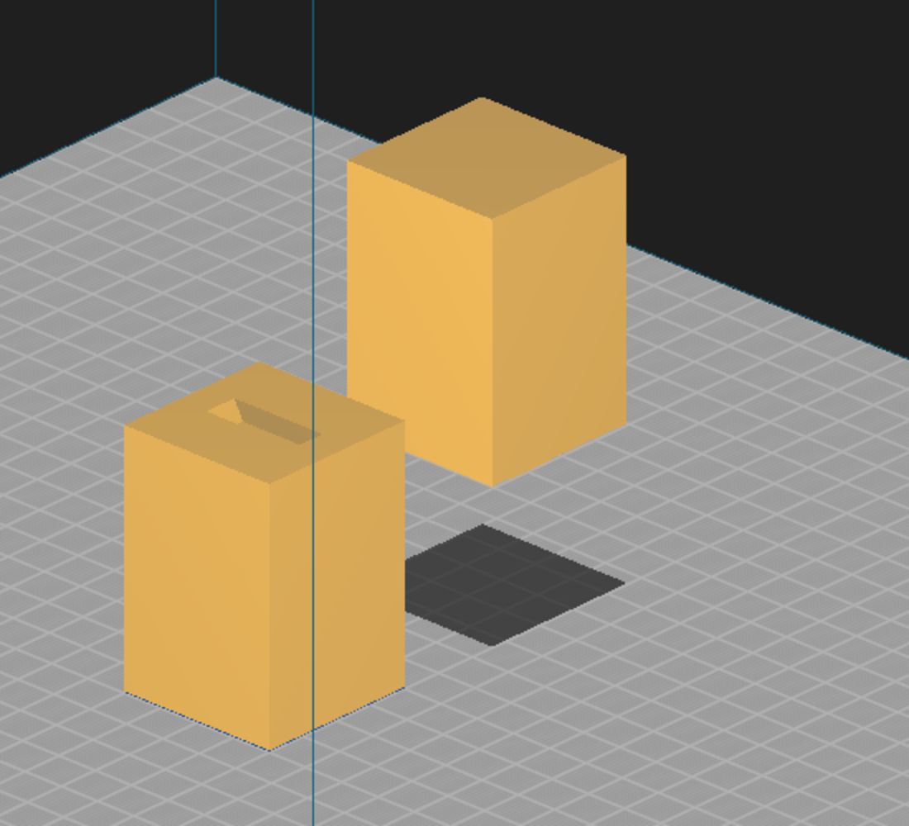

# cura-connect

A Cura plugin that splits a 3D model into printable pieces joined by real mechanical connectors — Plug, Dowel, Snap, or Dovetail — so the pieces reassemble precisely. The same four connector modes as OrcaSlicer/PrusaSlicer's built-in Cut Tool, built from scratch for Cura, which has no native equivalent.

## Why this exists

OrcaSlicer and PrusaSlicer have no public plugin API for adding custom UI or tools — confirmed directly from an OrcaSlicer maintainer discussion ([#9960](https://github.com/OrcaSlicer/OrcaSlicer/discussions/9960)), not assumed. Their Cut Tool's four connector modes (Plug, Dowel, Snap, Dovetail — confirmed against [Prusa's own Cut Tool documentation](https://help.prusa3d.com/article/cut-tool_1779)) are built into the app itself, not a plugin. Cura has a real plugin SDK but no built-in cut/connector tool at all — this project builds that missing piece.

Two existing Cura plugins do mesh splitting ([banana-split](https://github.com/jarrrgh/banana-split), a pseudo-split via duplicate-and-mirror, and [Cura-MeshTools](https://github.com/fieldOfView/Cura-MeshTools), which separates already-disconnected bodies) — neither generates connector geometry. This is genuinely new ground, not a reimplementation.

## Status: both phases built and verified against a real Cura install

Followed the same phased approach as [PolyForge](https://github.com/rx290/polyforge) and Lumeforge: build and fully verify the core engine standalone first, then wire it into the actual interactive Cura tool.

**Phase 1 — headless geometry engine:**
- `cura_plugin/CuraConnect/CuraConnect/core/geometry.py` — plane-split and shape-placement math on top of [manifold3d](https://github.com/elalish/manifold), which guarantees watertight boolean results (its `.status()` reports a real error code rather than silently producing broken geometry).
- `core/connectors.py` — all four connector types: Plug, Dowel, Snap, Dovetail.
- `core/scene_bridge.py` — converts between Cura's raw (unindexed, flat) mesh vertex arrays and manifold3d's indexed representation, including auto-correcting inverted winding order from a mirrored model.
- 48 tests, including differential proofs, not just isolated checks: a dedicated test shows the Dovetail piece genuinely resists being pulled straight apart along the cut normal (real interference), while the Plug piece — checked the same way — slides free with zero interference. Numerically confirmed the dovetail tail is 8.00mm wide at the seam and flares to 12.80mm at depth (exactly matching the configured flare), not just eyeballed from a render. Also covers the cross-section/suggestion heuristics and the adaptive connector sizing described below, including synthetic hollow-tube fixtures that reproduce the real bugs found on an actual model.
- `demo.py` exports real STL files for all four connector types from a plain test cube, for opening in any viewer.

**Phase 2 — the real interactive Cura Tool:** `CuraConnectTool.py` (a Uranium `Tool` subclass) plus `CuraConnectPanel.qml`. Select a model and activate the tool (toolbar icon or shortcut `J`) to get a cut plane suggested automatically — a translucent magenta preview (`CutPlaneIndicator.py`) at a position chosen to avoid thin/lattice cross-sections and, where possible, keep both resulting pieces within the current printer's bed. From there:

- **Reposition it** by dragging the model itself, or by dragging one of the colored arrows (`CutAxisToolHandle.py`) — the same line-plus-pyramid handles, and the same camera-facing drag-plane math, Cura's own Move tool uses.
- **Change axis** by clicking a different arrow.
- **Tilt it** by dragging the colored ring around the plane, or typing a value into the Tilt field — a single rotation on top of the axis-aligned position, not a full free-rotation gizmo (see the v1 scope note below). The ring is colored to match whichever axis is currently active (red/blue/green), the same convention Cura's own Move/Rotate tools use.
- **Adjust connectors** — width, depth, and count are suggested from the actual seam and are all directly editable.
- **Press Cut.**

This replaces the one selected node with two new ones (three for Dowel, including the loose pin), using `AddSceneNodeOperation`/`RemoveSceneNodeOperation` in a single undoable `GroupedOperation`, the same real pattern Cura's own bundled `SupportEraser` plugin uses. See [Usage](#usage) below for screenshots and the full walkthrough.

v1 scope, deliberately: full free rotation (any axis, any angle) isn't implemented — only a single tilt on top of the axis-aligned suggested position. A true 3-axis gizmo like PrusaSlicer/OrcaSlicer's own Cut Tool is real, separate follow-up work, not attempted here.

**Real bugs found while building this, not glossed over:**

- **Axis convention.** The default cut axis originally shipped as `Z`. Cura's scene graph is actually Y-up, not Z-up — confirmed directly from Cura's own STL reader (`STLReader.py`, which swaps columns 1/2 on import) and `cura/BuildVolume.py` (which treats bounding-box `.top`/`.bottom`, i.e. world Y, as the vertical/printable-height axis). So a `Z` default was splitting front/back (depth), not top/bottom. Fixed to default to `Y`.
- **The axis-picker's reach.** The colored arrows were originally a fixed 30mm from the model's center. On a model bigger than ~60mm, that put the arrow tip *inside* the model's own opaque surface — a click that looked like it hit the arrow was silently picked up by the model instead, since depth-tested picking correctly favored the nearer, opaque surface. Found by logging the real `getIdAtPosition()` result during a live click, not guessed. Fixed by scaling the arrows' reach to the model's own size.
- **A numpy-vs-native-float display bug.** Dragging the plane worked correctly from the first click, but the on-screen position number silently stopped updating. `UM.Math.Vector`'s components come back as a numpy scalar type, which contaminated `_plane_position` via `+=`; QML's text binding can't display that type, so it just kept showing the last value it could. Fixed with an explicit `float()` at the one place it mattered.
- **Connectors placed in hollow space.** Multiple connectors were spaced evenly across the seam's bounding-box span — correct for a solid cross-section, but a hollow or thin-walled model (a vase, a lampshade) has empty space in the middle of that span. Found on a real wavy vase model: the center connector landed with nothing to attach to. Fixed by testing each candidate position against the real split geometry (a boolean intersection, not a guess) before placing anything there.
- **Chunky connectors on thin walls.** Even after the fix above, connector width/depth were still sized from the seam's *overall* bounding-box span (~150mm for that same vase) rather than the actual wall thickness at one specific spot (often just a few mm) — producing a boss visibly wider than the wall it was attached to. The first fix attempt (measuring a "local thickness" from a probe's bounding box) turned out to have two of its own problems — a large probe wrapping around to the opposite wall of a hollow shape, and a curved wall inflating the reading — so the working fix instead directly *tests* candidate sizes against the real geometry and shrinks until one fits, rather than measuring and calculating backward.

**A real deployment wrinkle, solved, not glossed over:** Cura ships its own frozen Python (3.12 as of Cura 5.13), isolated from any system Python — `manifold3d` isn't among Cura's bundled packages, and there's no clean way to install into an AppImage-style bundle without root, nor does its AppRun launcher reliably pass through an external `PYTHONPATH`. Solved by vendoring the one compiled dependency (`manifold3d`) plus its pure-Python chain (`numpy-stl`, `python-utils`, `typing-extensions`) directly inside `cura_plugin/CuraConnect/CuraConnect/vendor/` — which Cura's own `PluginRegistry` already puts on `sys.path` when it loads the plugin, so no system files were touched and no environment variable had to survive the AppImage wrapper.

**Verified end-to-end in a real Cura 5.13 install, not just unit-tested:** every feature described above — the auto-suggested plane, dragging the model and the arrows, switching axis, the tilt ring, adaptive connector sizing, and the actual cut — has been exercised live against real models (a plain test box, the real Eiffel Tower, and a genuinely hollow wavy vase) in a real running Cura 5.13, not just asserted in unit tests. Screenshots of that below.

## Usage



Select a model and activate the tool. A plane is suggested automatically, along with the colored drag arrows and the tilt ring shown here (blue because Y is the active axis — same color as the panel's legend). Connector width, depth, and count are already filled in, computed from the real cross-section at that position.



Dragging the ring (or typing directly into the Tilt field) tilts the plane on top of whichever axis is active — useful for a cut that isn't flat, without needing a full 3D rotation gizmo.



Pressing Cut replaces the original model with two new pieces (visible in the object list as `_A`/`_B`), with connector geometry already applied at the seam.

## The four connectors

| Type | How it works | Assembly |
|---|---|---|
| **Plug** | A boss on one piece, a matching oversized cavity on the other | Press straight together |
| **Dowel** | A hole in both pieces plus a separate loose printable pin | Insert the pin, then press together |
| **Snap** | A peg with a bulbous tip into a socket with a narrower throat | Push past the throat (needs real material flex — see the honesty note below) |
| **Dovetail** | A trapezoidal tail, narrow at the seam and wider at depth | Slide along the joint's length — cannot be pulled straight apart |

**Honest limitation on Snap:** this project follows the same rule Lumeforge already established — don't fake a flex-dependent joint's real-world behavior. The Snap connector's automated tests can prove the *locked* state is collision-free and that the throat is genuinely narrower than the bulb (so it isn't a snap in name only), but they cannot simulate whether your actual filament/wall thickness will flex enough to assemble it. That depends on your printer and material, not on this geometry alone.

## Requirements

```
python3 -m venv .venv
.venv/bin/pip install -r requirements.txt
```

## Running the tests

```
.venv/bin/python -m pytest tests/ -v
```

## Installing the real Cura plugin

Copy `cura_plugin/CuraConnect/CuraConnect/` into your Cura plugins folder (Help → Show Configuration Folder → `plugins/CuraConnect/CuraConnect/`), restart Cura, and look for the tool at the bottom of the left toolbar (a chain-link icon, shortcut `J`). Select a model and activate the tool — see [Usage](#usage) above for the full walkthrough with screenshots.

## Trying the headless engine directly (no Cura install needed)

```
.venv/bin/python demo.py
```

Exports `plug_piece_a.stl`/`plug_piece_b.stl` (and equivalents for the other three types, plus `dowel_loose_pin.stl`) into `demo_output/`. Each pair shares world coordinates, so opening both files together in the same viewer shows them already assembled.
